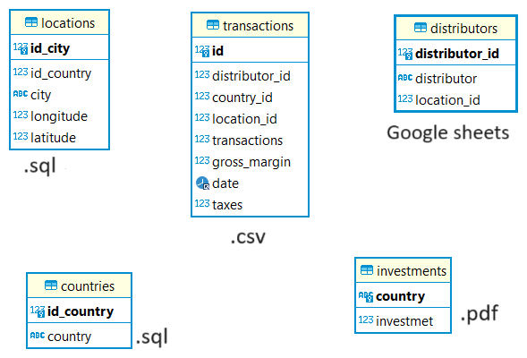
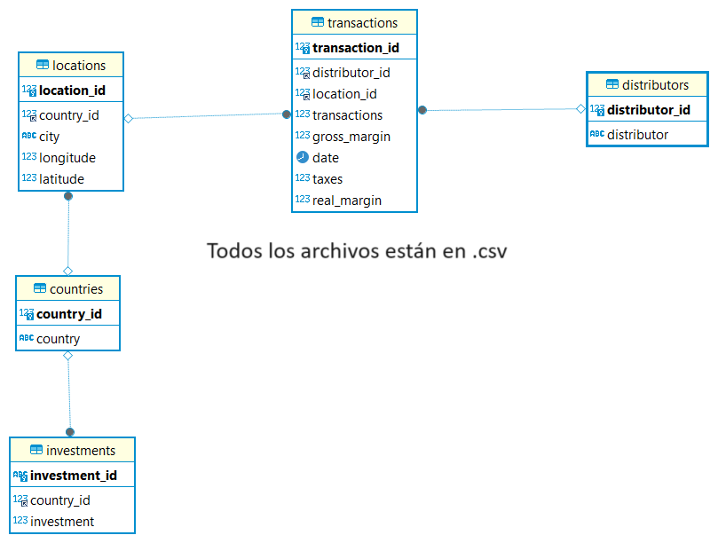

# Informe para Construction Materials Megacorp
## Debemos generar un informe para Construction Materials Megacorp, una empresa multinacional de materiales de construcción, que comenzó actividades en la región LATAM (comprendida por Argentina y países limítrofes) en el primer cuatrimestre de este año.

## Fuentes de datos y documentación recibida

1. **Registro de transacciones** – [transactions.csv](https://drive.google.com/file/d/1IRP7p_g7rSfDUGl-qtuQTx4K5njXSPUO/view?usp=sharingo)  
   - `id`: id de la transacción – autoincremental  
   - `distributor_id`: id del distribuidor  
   - `transactions`: cantidad de operaciones  
   - `gross_margin`: ganancia del total de las transacciones, luego de restar costos  
   - `date`: fecha del registro  
   - `taxes`: impuestos adeudados sobre las ganancias  
   - ⚠️ *No deben existir dos transacciones idénticas con la misma fecha*

2. **Lista de distribuidores** – (Google Sheets) [distributors](https://docs.google.com/spreadsheets/d/1qrP4fuXffpsHZ7XrGK5lzdo5vhXC0RhXwMisS2zc5vc/edit?usp=sharing)
   - `distributor_id`: id del distribuidor  
   - `distributor`: nombre de la empresa distribuidora  
   - `location_id`: id de la ciudad de la distribuidora

3. **Registro de inversiones por país** – [investments.pdf](https://drive.google.com/file/d/1st70dUmTSvKMhMh98swW_Bt-Na9rmXvo/view?usp=sharing) 
   - ⚠️ *Se perdió el archivo original, pero se dispone de un reporte en PDF*

4. **Archivo de geolocalización de ciudades** – [locations.SQL](https://drive.google.com/file/d/1NYxYRsqSxVPO8uAjMAXtsV1jFaNkf4t2/view?usp=sharing) 
   - `id_city`: id de la ciudad  
   - `id_country`: id del país  
   - `city`: nombre de la ciudad  
   - `longitude`, `latitude`: coordenadas

5. **Lista de países donde opera** – [countries.SQL](https://drive.google.com/file/d/1Phq25bGp5o0TcPxTu0CMWVav97PRCkZK/view?usp=sharing)
   - `id_country`: id del país  
   - `country`: nombre del país

## Parte I: Análisis operaciones en LATAM

### Objetivo

Generar un Dashboard que muestre:

### 1. Panorama general:
- a) Cantidad de **ciudades** en las que opera  
- b) Cantidad de **distribuidores**  
- c) Total de **transacciones realizadas**  
- d) Total de **ganancia bruta**  
- e) Total de **impuestos a pagar** (3,5% sobre la ganancia bruta)

### 2. Análisis discriminado por país:
- a) **Mapa de ganancias reales**  
  - ¿Qué tipo de mapa es el más apropiado?  
  - ¿Cuál es el que muestra la información más claramente?  
  - **Datos emergentes:** País y ganancia real  
  - 🔹 *Ganancia real = ganancia bruta - impuestos*

- b) **Cantidad de transacciones**  
- c) **Ganancias reales**

### 3. Ganancia real por mes

### 4. Inversión vs Ganancias reales por país

### 5. Auditoría sugerida
- ¿Deberíamos **auditar** las operaciones en alguno de estos países?  
- Fundamentar la respuesta

## Diagrama de las tablas originales

## Diagrama de las tablas nuevas 

## Dashboard con el informe
## [Informe y graficos](https://lookerstudio.google.com/reporting/3576804b-e233-47d2-9f21-2059311c41eb)